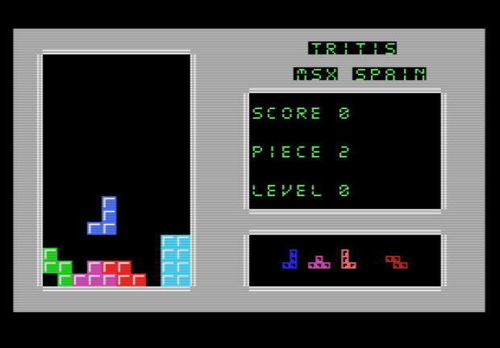
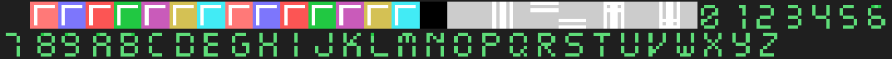
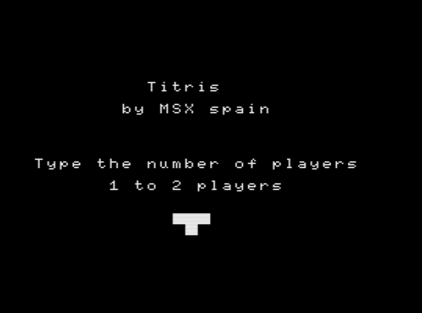
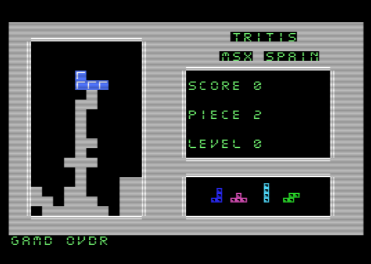
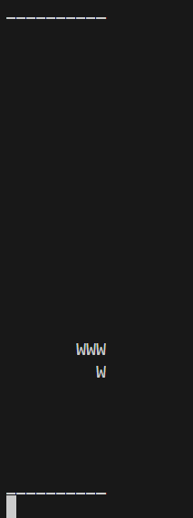

# TRITIS

El juego de lógica más famoso, se trata de juntar piezas para eliminar líneas.

# MSX-C

### Play online

https://kikemadrigal.github.io/tetris-MSX-C-python/?disk=game.dsk

## Development

### Spriteset

Los sprites solo se muestran en la parte inferior derecha

### Tileset

### Screens / levels

Menu

Juego

Game over

## Build

Escriba en el command pront de windows:

cd MSX-C (para entrar en el directorio)

make.bat (para ejecutar)

Si estás en sistemas Unix, escribe:

cd MSX-C (para entrar en el directorio)

chmod +x make.sh (para darle los permisos de ejecución)

./make.sh (para ejecutar)

# Pyton

